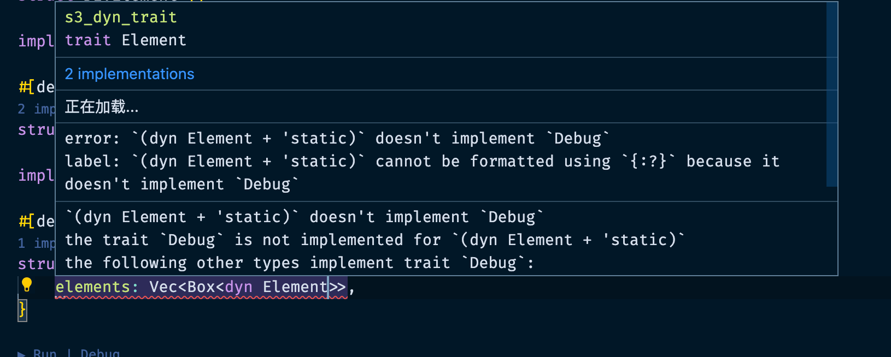

# 一文让你在 Rust 中实现多态

在 Rust 中我们经常可能会使用类似多态思想去开发一个框架或者功能。
这里仓主最近也在开发一个小框架 drawpanel 的时候需要这样的特性去支持。

> 这里简单说一下 drawpanel 的功能，drawpanel 是一个画板框架，其中每一种绘画元素都是可以自定义的。

## 实现

比如我们现在实现一个 DOM 渲染器，代码如下：

```rust
use std::fmt::Debug;

trait Element {}

struct DivElement {}

impl Element for DivElement {}

struct AElement {}

impl Element for AElement {}

struct Render {
    elements: Vec<Box<dyn Element>>,
}

fn main() {
    let render = Render {
        elements: Vec::new(),
    };
}


```

代码很简单的实现了，利用 trait + Box 实现了多态特性。

我们来打印看看

```rust
use std::fmt::Debug;

trait Element {}

#[derive(Debug)]
struct DivElement {}

impl Element for DivElement {}

#[derive(Debug)]
struct AElement {}

impl Element for AElement {}

#[derive(Debug)]
struct Render {
    elements: Vec<Box<dyn Element>>,
}

fn main() {
    let render = Render {
        elements: Vec::new(),
    };
    println!("{:?}", render);
}

```



但是发生了错误：

这里翻译一下原因，是这样的因为 Render 实现了 Debug 这个 trait，但是里面的子元素 elements 不确定到底有没有实现 Debug，所以报错了。

所以我们的解决思路就是约束 `dyn Element` 必须让他实现 Debug，顺着这个思路有了下面的代码。

```rust
use std::fmt::Debug;

trait Element:Debug {}

// ...
```

我们在定义 trait 的时候限制一下 Element 必须实现 Debug。

我们运行一下：

```
    Finished dev [unoptimized + debuginfo] target(s) in 0.61s
     Running `target/debug/s3_dyn_trait`
Render { elements: [] }
```

成功输出了。

乍得一款这样目前也没什么问题，但是其实有个严重的问题就是，我们必须给所有类型都实现 Debug，有没有更灵活的方式呢？

答案是有的，看下面代码：

```rust
use std::fmt::Debug;

trait Element {}

trait IElement: Element + Debug {}

#[derive(Debug)]
struct DivElement {}

impl Element for DivElement {}

#[derive(Debug)]
struct AElement {}

impl Element for AElement {}

#[derive(Debug)]
struct Render {
    elements: Vec<Box<dyn IElement>>,
}

fn main() {
    let render = Render {
        elements: Vec::new(),
    };
    println!("{:?}", render);
}

```

我们可以定义一个中间的 trait `IElement`来继承 Element 和 Debug，但是在实现组件的时候我们用的是 Element，这样就满足了上面的需求，我们可以选择性的是否给组件实现 Debug，比如我们不需要打印那就不用实现 Debug 了。

## 结束

内容到这里就结束了，这里是我找到的两种方案，如果大家有更好的方案可以提交 Issue 或者评论，我们一起来讨论一下。

最后欢迎大家来关注 [rust-boom/rust-boom: rust awesome. (github.com)](https://github.com/rust-boom/rust-boom)仓库，这里会汇总 rust 各种中文资源、框架、库、软件等欢迎来 star，您的 star 就是我创作和维护的动力。
