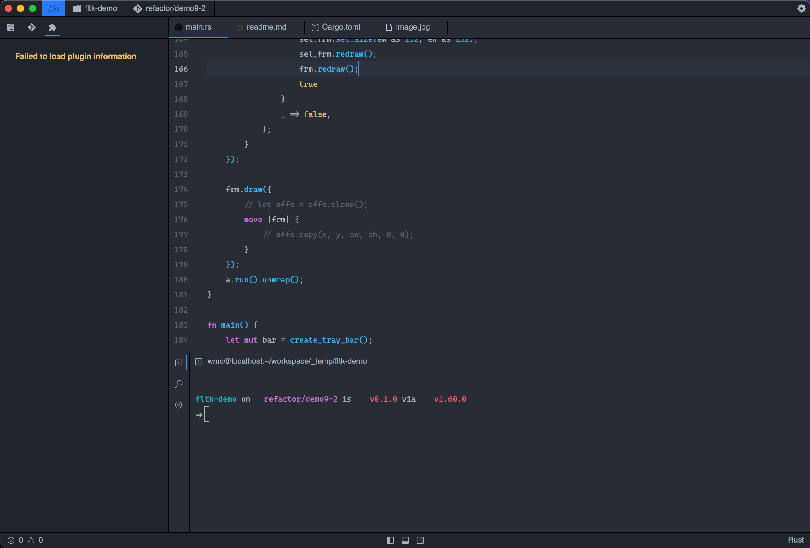

<div align="center">
	<p></p>
  <p></p>
</div>

# Rust Boom 💥

Rust Boom 是一个仓主在学习使用 Rust 的时候，对 Rust 的一些难点的解决方法以及一些 Rust 开源的好玩的库、书籍、文章的整理，希望可以帮助更多的 Rust 初学者来翻过 Rust 这座大山。

## TOC

- [Rust Boom 💥](#rust-boom-)
  - [TOC](#toc)
  - [Blasting](#blasting)
  - [Article](#article)
  - [Video](#video)
  - [Book](#book)
    - [Rust 语言圣经中文版](#rust-语言圣经中文版)
    - [Rust 程序设计语言中文版](#rust-程序设计语言中文版)
    - [通过例子学 Rust 中文版](#通过例子学-rust-中文版)
    - [谷歌开源的 Rust 教程 (Comprehensive Rust 🦀)](#谷歌开源的-rust-教程-comprehensive-rust-)
    - [RustPrimer](#rustprimer)
    - [Rust 秘典中文版](#rust-秘典中文版)
    - [Rust 参考手册 中文版](#rust-参考手册-中文版)
    - [Rust Cookbook 中文版](#rust-cookbook-中文版)
    - [Rusty Book( 锈书 )](#rusty-book-锈书-)
    - [Rust 异步编程指南](#rust-异步编程指南)
    - [Rust 语言实战](#rust-语言实战)
    - [Rust 算法题解](#rust-算法题解)
    - [Rust 算法书（RustBook）](#rust-算法书rustbook)
    - [Rust 设计模式 中文版](#rust-设计模式-中文版)
    - [Rust API 编写指南 中文版](#rust-api-编写指南-中文版)
    - [Rust 宏小册(tlborm)](#rust-宏小册tlborm)
    - [嵌入式 Rust 编程](#嵌入式-rust-编程)
    - [TheAlgorithms(Rust 算法例子)](#thealgorithmsrust-算法例子)
    - [Rust RFC Book (提案书)](#rust-rfc-book-提案书)
    - [Rust Unstable Book (不稳定特性书)](#rust-unstable-book-不稳定特性书)
    - [Rust 版本指南](#rust-版本指南)
    - [Rust 标准库手册中文版](#rust-标准库手册中文版)
    - [inside-rust-std-library (标准库手册帮助文档)](#inside-rust-std-library-标准库手册帮助文档)
    - [Cargo 中文文档](#cargo-中文文档)
    - [Rustt 一个优秀 Rust 文档翻译仓库](#rustt-一个优秀-rust-文档翻译仓库)
  - [DevTools](#devtools)
    - [IDE](#ide)
      - [VSCode（首推）](#vscode首推)
    - [Cargo 命令](#cargo-命令)
      - [cargo-edit](#cargo-edit)
      - [cargo-watch](#cargo-watch)
  - [Framework](#framework)
    - [GUI](#gui)
      - [Tauri](#tauri)
      - [egui](#egui)
      - [fltk-rs](#fltk-rs)
      - [iced](#iced)
      - [druid](#druid)
      - [Dioxus](#dioxus)
      - [Vizia](#vizia)
      - [slint](#slint)
    - [TUI](#tui)
      - [tui-rs](#tui-rs)
    - [CLI](#cli)
      - [commander](#commander)
    - [游戏开发](#游戏开发)
      - [Bevy](#bevy)
      - [tetra](#tetra)
      - [amethyst](#amethyst)
    - [异步运行时](#异步运行时)
      - [Tokio](#tokio)
    - [前端相关](#前端相关)
      - [Yew](#yew)
      - [Deno](#deno)
      - [SWC](#swc)
      - [Parcel](#parcel)
      - [Rome](#rome)
      - [napi-rs](#napi-rs)
    - [WebAssembly](#webassembly)
      - [wasmtime](#wasmtime)
      - [wasmer](#wasmer)
      - [WasmEdge](#wasmedge)
      - [WASI](#wasi)
    - [网络](#网络)
      - [libp2p](#libp2p)
      - [rathole](#rathole)
      - [Crust](#crust)
    - [服务端](#服务端)
      - [Rocket](#rocket)
      - [Actix Web](#actix-web)
      - [warp](#warp)
      - [poem](#poem)
      - [axum](#axum)
      - [Salvo](#salvo)
    - [序列化](#序列化)
      - [A-JSON](#a-json)
      - [json-rust](#json-rust)
      - [pikkr](#pikkr)
      - [Serde](#serde)
      - [quick-xml](#quick-xml)
      - [musli](#musli)
    - [配置解析](#配置解析)
      - [config-rs](#config-rs)
    - [日期处理](#日期处理)
      - [time](#time)
      - [chrono](#chrono)
      - [httpdate](#httpdate)
    - [编码库](#编码库)
      - [base64](#base64)
      - [hmac](#hmac)
      - [jwt](#jwt)
      - [josekit](#josekit)
      - [sha](#sha)
      - [utf8mb3](#utf8mb3)
    - [数据库](#数据库)
      - [SeaORM](#seaorm)
      - [rbatis](#rbatis)
      - [MongoDB Rust Driver](#mongodb-rust-driver)
      - [wither](#wither)
      - [redis-rs](#redis-rs)
      - [r2d2](#r2d2)
    - [单元测试](#单元测试)
      - [mockall](#mockall)
    - [几何计算](#几何计算)
      - [geo](#geo)
    - [图片处理](#图片处理)
      - [image-rs](#image-rs)
    - [音频处理](#音频处理)
      - [Symphonia](#symphonia)
    - [视频处理](#视频处理)
      - [ffmpeg-sys-next](#ffmpeg-sys-next)
    - [文档处理](#文档处理)
      - [lopdf](#lopdf)
      - [pdf-rs](#pdf-rs)
      - [calamine](#calamine)
      - [docx-rs](#docx-rs)
      - [Polars](#polars)
    - [AST](#ast)
      - [antlr-rust](#antlr-rust)
      - [pandoc_ast](#pandoc_ast)
    - [自动化](#自动化)
      - [headless_chrome](#headless_chrome)
      - [enigo](#enigo)
      - [InputBot](#inputbot)
    - [系统相关](#系统相关)
      - [screenshots](#screenshots)
      - [execute](#execute)
    - [机器学习](#机器学习)
      - [neuronika](#neuronika)
    - [语言绑定 (FFI)](#语言绑定-ffi)
      - [cbindgen](#cbindgen)
      - [PyO3](#pyo3)
    - [图形渲染](#图形渲染)
      - [Speedy2D](#speedy2d)
      - [wgpu](#wgpu)
      - [glium](#glium)
      - [vulkano](#vulkano)
      - [nannou](#nannou)
      - [raqote](#raqote)
    - [日志库](#日志库)
      - [vector](#vector)
    - [RPC 库](#rpc-库)
      - [Dubbo-rust](#dubbo-rust)
      - [volo](#volo)
    - [SDL](#sdl)
      - [Rust-SDL2](#rust-sdl2)
    - [辅助工具库](#辅助工具库)
      - [educe](#educe)
  - [Applications](#applications)
    - [文本编辑器](#文本编辑器)
      - [AppFlowy](#appflowy)
      - [Lapce](#lapce)
      - [Neovide](#neovide)
      - [Helix](#helix)
    - [远程控制](#远程控制)
      - [Rustdesk](#rustdesk)
    - [Git 工具](#git-工具)
      - [GitUI](#gitui)
    - [内网穿透](#内网穿透)
      - [bore](#bore)
    - [代码分析](#代码分析)
      - [cloc-rs](#cloc-rs)
    - [数据库](#数据库-1)
      - [cnosdb](#cnosdb)
    - [操作系统](#操作系统)
      - [Bottlerocket OS](#bottlerocket-os)
    - [编译器](#编译器)
      - [Starlight](#starlight)
    - [搜索引擎](#搜索引擎)
      - [MeiliSearch](#meilisearch)
      - [sonic](#sonic)
    - [系统工具](#系统工具)
      - [RustScan](#rustscan)
      - [sniffnet](#sniffnet)
    - [视频工具](#视频工具)
      - [biliup-rs](#biliup-rs)
  - [Community](#community)
  - [Incident](#incident)
  - [Note](#note)
  - [License](#license)

## Blasting

> 我自己写的一些关于 Rust 特殊问题的处理和解决方案。

- [一篇文章让你彻底理解 Rust 的 Move、Copy、Clone](docs/s1_move_copy_clone/readme.md)
- [一文让你了解在 Rust 中实现方法重载模式](docs/s2_overload/readme.md)
- [一文让你在 Rust 中实现多态](docs/s3_dyn_trait/readme.md)

## Article

> 收集一些 Rust 比较好的文章以及一些刊报。

- [安装 Rust - Rust 程序设计语言 (rust-lang.org)](https://www.rust-lang.org/zh-CN/tools/install)
- [浅析 rust 的内存管理 - 知乎 (zhihu.com)](https://zhuanlan.zhihu.com/p/365766807)
- [Rust: Lifetime 解惑， 生命周期还在 - 知乎 (zhihu.com)](https://zhuanlan.zhihu.com/p/384151733)
- [Rust 中的 String,&str 和 str 都是什么？ - 知乎 (zhihu.com)](https://zhuanlan.zhihu.com/p/384496181)
- [类型的大小 - 知乎 (zhihu.com)](https://zhuanlan.zhihu.com/p/21820917)
- [如何深入浅出地理解 Rust 中的 Pin 和 Unpin? - 知乎 (zhihu.com)](https://www.zhihu.com/question/512654366/answer/2319171118)
- [rust 语言基础学习: rust 所有权之 Move 和 Copy 语义 - 架构小白|青蛙小白|关注程序开发、互联网技术、云原生 (frognew.com)](https://blog.frognew.com/2020/07/rust-ownership-move-and-copy.html)
- [Top 23 Rust GUI Projects (Jul 2022) (libhunt.com)](https://www.libhunt.com/l/rust/topic/gui)
- [你见过哪些让你瞠目结舌的 Rust 代码技巧？ - 知乎 (zhihu.com)](https://www.zhihu.com/question/282113351/answer/2483371362)
- [rustlang-cn/rust-weekly: Rust 语言周刊，每周五发布，精选过去一周的技术文章、业界新闻、开源项目和 Rust 语言动态 (github.com)](https://github.com/rustlang-cn/rust-weekly)
- [【每周一知】Rust 中的三种设计模式 - Rust 语言中文社区 (rustcc.cn)](https://rustcc.cn/article?id=2b1703cc-36f9-4dfc-a70a-09dd67a207ab)
- [用 Rust 写一个容器|Writing a container in Rust | Blog of Litchi Pi](https://litchipi.github.io/series/container_in_rust)
- [yunwei37/blockchain-rust: blockchain_go in rust: A simplified blockchain implementation in rust for leaning / 用 rust 从零开始构建区块链(Bitcoin) (github.com)](https://github.com/yunwei37/blockchain-rust)
- [Rust 笔记 一文讲透 Rust 中的 PartialEq 和 Eq (qq.com)](https://mp.weixin.qq.com/s/hdW2QjAExPs1cE9rV1tn4Q)
- [Rust 代码执行解析的可视化过程，初学者可以通过这个更深入的了解 Rust 的所有权等特性)](https://cognitive-engineering-lab.github.io/aquascope/)
- [用 Rust 实现一个 GUI 框架](https://samsartor.com/guis-1/)
- [运行 1 万个并发任务需要多少内存？ (pkolaczk.github.io)](https://pkolaczk.github.io/memory-consumption-of-async/)

## Video

> 该模块收集一些 Rust 相关的教程视频，视频主要来源 B 站和知乎。

- [Rust 编程语言入门教程（Rust 语言/Rust 权威指南配套）【已完结】](https://www.bilibili.com/video/BV1hp4y1k7SV?share_source=copy_web&vd_source=48cb37f6a16cf0feaf678d7beba9e00d)
- [Rust Async 异步编程（完结）](https://www.bilibili.com/video/BV1Ki4y1C7gj?share_source=copy_web&vd_source=48cb37f6a16cf0feaf678d7beba9e00d)
- [Rust Async 异步编程 简易教程](https://www.bilibili.com/video/BV16r4y187P4?share_source=copy_web&vd_source=48cb37f6a16cf0feaf678d7beba9e00d)
- [Rust Web 全栈开发教程【完结】](https://www.bilibili.com/video/BV1RP4y1G7KF?share_source=copy_web&vd_source=48cb37f6a16cf0feaf678d7beba9e00d)
- [使用 Async Rust 构建简单的 P2P 节点【完结】](https://www.bilibili.com/video/BV13a41197F1?share_source=copy_web&vd_source=48cb37f6a16cf0feaf678d7beba9e00d)
- [从零开始创建一个 WebAssembly 游戏](https://www.bilibili.com/video/BV19a41127Dq?share_source=copy_web&vd_source=48cb37f6a16cf0feaf678d7beba9e00d)
- [Rust 面试题](https://www.bilibili.com/video/BV1m94y1U7eZ?share_source=copy_web&vd_source=48cb37f6a16cf0feaf678d7beba9e00d)
- [可视化 Rust 各数据结构的内存布局(必看)](https://www.bilibili.com/video/BV1KT4y167f1?share_source=copy_web&vd_source=48cb37f6a16cf0feaf678d7beba9e00d)

## Book

> Rust 的书。

### Rust 语言圣经中文版

 

> 
>
> Rust 语言真的好：连续七年成为全世界最受欢迎的语言、没有 GC 也无需手动内存管理、性能比肩 C++/C 还能直接调用它们的代码、安全性极高 - 总有公司说使用 Rust 后以前的大部分 bug 都将自动消失、全世界最好的包管理工具 Cargo 等等。但...

在线文档：[Rust 语言圣经 - Rust 语言圣经(Rust Course)](https://course.rs/about-book.html)

文档仓库：[sunface/rust-course: “连续六年成为全世界最受喜爱的语言，无 GC 也无需手动内存管理、极高的性能和安全性、过程/OO/函数式编程、优秀的包管理、JS 未来基石" — 工作之余的第二语言来试试 Rust 吧。<>拥有全面且深入的讲解、生动贴切的示例、德芙般丝滑的内容，甚至还有 JS 程序员关注的 WASM 和 Deno 等专题。这可能是目前最用心的 Rust 中文学习教程/书籍 (github.com)](https://github.com/sunface/rust-course)

### Rust 程序设计语言中文版

> Rust 程序设计语言的本质实际在于 **赋能**（_empowerment_）：无论你现在编写的是何种代码，Rust 能让你在更为广泛的编程领域走得更远，写出自信。（这一点并不显而易见）
>
> 举例来说，那些“系统层面”的工作涉及内存管理、数据表示和并发等底层细节。从传统角度来看，这是一个神秘的编程领域，只为浸润多年的极少数人所触及，也只有他们能避开那些臭名昭著的陷阱。即使谨慎的实践者，亦唯恐代码出现漏洞、崩溃或损坏。
>
> Rust 破除了这些障碍：它消除了旧的陷阱，并提供了伴你一路同行的友好、精良的工具。想要 “深入” 底层控制的程序员可以使用 Rust，无需时刻担心出现崩溃或安全漏洞，也无需因为工具链不靠谱而被迫去了解其中的细节。更妙的是，语言设计本身会自然而然地引导你编写出可靠的代码，并且运行速度和内存使用上都十分高效。
>
> 已经在从事编写底层代码的程序员可以使用 Rust 来提升抱负。例如，在 Rust 中引入并行是相对低风险的操作，因为编译器会替你找到经典的错误。同时你可以自信地采取更加激进的优化，而不会意外引入崩溃或漏洞。
>
> 但 Rust 并不局限于底层系统编程。它表达力强、写起来舒适，让人能够轻松地编写出命令行应用、网络服务器等各种类型的代码——在本书中就有这两者的简单示例。使用 Rust 能让你把在一个领域中学习的技能延伸到另一个领域：你可以通过编写网页应用来学习 Rust，接着将同样的技能应用到你的 Raspberry Pi（树莓派）上。
>
> 本书全面介绍了 Rust 为用户赋予的能力。其内容平易近人，致力于帮助你提升 Rust 的知识，并且提升你作为程序员整体的理解与自信。欢迎你加入 Rust 社区，让我们准备深入学习 Rust 吧！
>
> —— Nicholas Matsakis 和 Aaron Turon

在线文档：[Rust 程序设计语言](https://kaisery.github.io/trpl-zh-cn/#rust-程序设计语言)

配套视频：[Rust 编程语言入门教程（Rust 语言/Rust 权威指南配套）【已完结】](https://www.bilibili.com/video/BV1hp4y1k7SV?share_source=copy_web&vd_source=48cb37f6a16cf0feaf678d7beba9e00d)

### 通过例子学 Rust 中文版

 

> [Rust](https://www.rust-lang.org/) 是一门注重安全（safety）、速度（speed）和并发（concurrency）的现代系统编程语言。Rust 通过内存安全来实现以上目标，但不使用垃圾回收机制（garbage collection, GC）。
>
> 《通过例子学 Rust》（Rust By Example, RBE）内容由一系列可运行的实例组成，通过这些例子阐明了各种 Rust 的概念和基本库。想获取这些例子外的更多内容，不要忘了[安装 Rust 到本地](https://www.rust-lang.org/tools/install)并查阅[官方标准库文档](https://rustwiki.org/zh-CN/std/)。另外为了满足您的好奇心，您还可以[查阅本网站的源代码](https://github.com/rust-lang-cn/rust-by-example-cn)。

在线文档：[简介 - 通过例子学 Rust 中文版 (rustwiki.org)](https://rustwiki.org/zh-CN/rust-by-example/)

文档仓库：[rust-lang-cn/rust-by-example-cn: Rust By Example 中文版(包含在线代码编辑器) (github.com)](https://github.com/rust-lang-cn/rust-by-example-cn)

### 谷歌开源的 Rust 教程 (Comprehensive Rust 🦀)

 

> 这个资源库有 Comprehensive Rust 的源代码，这是由 Android 团队开发的为期四天的 Rust 课程。该课程涵盖了 Rust 的所有方面，从基本语法到泛型和错误处理。它还包括最后一天的 Android 特定内容。

在线文档：[Welcome to Comprehensive Rust 🦀 - Comprehensive Rust 🦀 (google.github.io)](https://google.github.io/comprehensive-rust/)

文档仓库：[google/comprehensive-rust: This is the Rust course used by the Android team at Google. It provides you the material to quickly teach Rust to everyone. (github.com)](https://github.com/google/comprehensive-rust)

### RustPrimer

 

> 给初学者的 Rust 中文教程。

在线文档：[Introduction · RustPrimer (gitbooks.io)](https://rustcc.gitbooks.io/rustprimer/content/)

文档仓库：[rustcc/RustPrimer: The Rust primer for beginners. We need native English speaker help us modify the translation. (github.com)](https://github.com/rustcc/RustPrimer)

### Rust 秘典中文版

 

> Rust 秘典挖掘了你在编写不安全 Rust 程序时需要了解的所有可怕的细节。
>
> 如果你希望在编写 Rust 程序的过程中获得长久而快乐的职业生涯，你应该现在回头，忘记你曾经看过这本书。 它没有必要。 然而，如果你打算编写不安全代码——或者只是想深入了解语言的内涵——这本书包含了很多有用的信息。

在线文档：[介绍 - Rust 秘典（死灵书） (purewhite.io)](https://nomicon.purewhite.io/intro.html)

文档仓库：[rust-lang-cn/nomicon-zh-Hans: Rust 死灵书简体中文翻译 (github.com)](https://github.com/rust-lang-cn/nomicon-zh-Hans)

### Rust 参考手册 中文版

 

> 本书是 Rust 编程语言的主要参考资料。它提供了三种材料:
>
> - 非正式地描述每个语言结构及其使用的章节。
> - 非正式描述内存模型、并发模型、运行时服务、链接模型和调试设施的章节。
> - 附录章节提供了影响设计的语言的原理和参考。

在线文档：[简介 - Rust 参考手册 中文版 (rustwiki.org)](https://rustwiki.org/zh-CN/reference/)

文档仓库：[rust-lang-cn/reference-cn: Rust 参考手册——Chinese translation of The Rust Reference (github.com)](https://github.com/rust-lang-cn/reference-cn)

### Rust Cookbook 中文版

 

> 《Rust Cookbook 中文版》是 Rust 程序设计语言（[Rust 官方教程简体中文版](https://rustwiki.org/zh-CN/book)）的简要实例示例集合：展示了在 Rust 生态系统中，使用各类 crate 来完成常见编程任务的良好实践。

在线文档：[总览 - Rust Cookbook 中文版 (rustwiki.org)](https://rustwiki.org/zh-CN/rust-cookbook/)

文档仓库：[rust-lang-cn/rust-cookbook-cn: Rust Cookbook 中文版——Chinese translation of The Rust Cookbook (github.com)](https://github.com/rust-lang-cn/rust-cookbook-cn)

### Rusty Book( 锈书 )

 

> 在 Rust 元宇宙，夸奖别人的最高境界就是 `rusty`: 今天你"锈"了吗? 你的 Rust 代码好锈啊！而本书，就是精选了各种开源库和代码片段，帮助大家打造优"锈"的 Rust 项目。
>
> 总之，如果有以下需求，那看锈书就对了：
>
> - 想要知道现在优秀的、关注度高的 Rust 项目有哪些
> - 发现一些好玩、有趣、酷炫的开源库
> - 需要寻找某个类型的库，例如，一个 HTTP 客户端或 ProtoBuffer 编码库，要求是好用、更新活跃、高质量
> - 想要寻找常用操作的代码片段，用于熟悉 Rust 或者直接复制粘贴到自己的项目中，例如文件操作、数据库操作、HTTP 请求、排序算法、正则等

在线文档：[Rusty Book - Rusty Book(锈书)](https://rusty.rs/about.html)

文档仓库：[rustlang-cn/rusty-book: A curated list of recipes and repos that can be used to build your rusty projects. Rusty Book = Cookbook + Awesome Rust！ (github.com)](https://github.com/rustlang-cn/rusty-book)

### Rust 异步编程指南

 

> 该书是中文 Rust 教程 <<Rust 语言圣经>> 中的镜像专题，高质量手翻 Asynchronous Programming in Rust， 深入讲述了如何编写 Rust 高并发异步程序。

文档仓库：[rustlang-cn/async-book: 该书是中文 Rust 教程 <> 中的镜像专题，高质量手翻 Asynchronous Programming in Rust， 深入讲述了如何编写 Rust 高并发异步程序 (github.com)](https://github.com/rustlang-cn/async-book)

配套视频：[Rust Async 异步编程（完结）](https://www.bilibili.com/video/BV1Ki4y1C7gj?share_source=copy_web&vd_source=48cb37f6a16cf0feaf678d7beba9e00d)

### Rust 语言实战

 

> _Rust 语言实战_ 的目标是通过大量的实战练习帮助大家更好的学习和上手使用 Rust 语言。书中的练习题非常易于使用：你所需的就是在线完成练习，并让它通过编译。

在线文档：[关于 pracitce.rs - Rust By Practice( Rust 练习实践 )](https://zh.practice.rs/why-exercise.html)

文档仓库：[sunface/rust-by-practice: Learning Rust By Practice, narrowing the gap between beginner and skilled-dev with challenging examples, exercises and projects. (github.com)](https://github.com/sunface/rust-by-practice)

### Rust 算法题解

 

> Rust 作为一门现代化的系统编程语言，拥有与 C/C++ 类似的性能，同时又能做非常底层的性能优化，因此非常适合写算法和 leetcode。
>
> `algos` 涵盖了各种常用算法和数据结构的代码实现，以及 leetcode 题解，同时对于相关算法还提供了中文文档和注释，可以帮助大家更好、更快的学习。

在线文档：[Rust 算法题解 - 《Rust 算法题解 / Rust 算法教程》 - 书栈网 · BookStack](https://www.bookstack.cn/read/rustlang-cn-rust-algos/README.md)

文档仓库：[rustlang-cn/rust-algos: <>，用 Rust 语言实现常见的算法和数据结构，以及 leetcode 题解，algos = algorithms，written with ❤️ by course.rs team (github.com)](https://github.com/rustlang-cn/rust-algos)

### Rust 算法书（RustBook）

 

> 一本 [Rust](https://www.rust-lang.org/) 书籍，有简体和繁体版（英文版和日文版正在撰写中）。内容包括算法分析，基本数据结构和算法，外加一些实战。共有九章，其目录如下。
>
> - 第一章：计算机科学
>   - 计算机科学
>   - Rust 回顾及学习资源
> - 第二章：算法分析
>   - 性能分析：大 O 分析法
> - 第三章：基本数据结构
>   - 栈、队列、双端队列、链表、Vec
>
> ...

在线文档：https://www.sejda.com/share/f71f6c36a72242649d5dd0b82c1ede74-z6Nih_rxggHzMXaWzNG6gEwmQ9MikrbmfygnukTf4ZjagPIlz-HuNbHsukdGz1xD

文档仓库：[QMHTMY/RustBook: A book about Rust Data Structures and Algorithms. (github.com)](https://github.com/QMHTMY/RustBook)

### Rust 设计模式 中文版

 

> 有很多问题有相同的形式。 因为 Rust 不是面向对象的语言，所以设计模式与其他面向对象语言的设计模式也有所不同。 虽然细节上有所不同，但他们还是有很多相同之处：
>
> - [设计模式](http://chuxiuhong.com/chuxiuhong-rust-patterns-zh/patterns/index.html) 是编写软件过程中解决常见问题的方法。
> - [反模式](http://chuxiuhong.com/chuxiuhong-rust-patterns-zh/anti_patterns/index.html) 是解决常见问题的方法。 然而设计模式带给我们好处，反模式却带来更多的问题。
> - [习惯用法](http://chuxiuhong.com/chuxiuhong-rust-patterns-zh/idioms/index.html) 是编码的指导方针。它是社区的共同规范。除非你有明确的理由， 否则就遵守它。

在线文档：[引言 - Rust 设计模式 (chuxiuhong.com)](http://chuxiuhong.com/chuxiuhong-rust-patterns-zh/)

文档仓库：[chuxiuhong/chuxiuhong-rust-patterns-zh: Rust 设计模式中文翻译 (github.com)](https://github.com/chuxiuhong/chuxiuhong-rust-patterns-zh)

### Rust API 编写指南 中文版

 

> 这是一组关于如何设计和呈现 Rust APIs 的建议。 这些建议主要由 Rust library 团队编写， 总结了 Rust 生态下构建标准库和其他 crates 的经验。

在线文档：[关于本书 - Rust API Guidelines（Rust API 编写指南） (zjp-cn.github.io)](https://zjp-cn.github.io/api-guidelines/)

文档仓库：[zjp-CN/api-guidelines: Rust API Guidelines 中文翻译版 (github.com)](https://github.com/zjp-CN/api-guidelines)

### Rust 宏小册(tlborm)

 

> 本书试图提炼出一份 Rust 社区对 Rust 宏知识的集锦。

在线文档：[Rust 宏小册 中文版 - 《Rust 宏小册 中文版》 - 书栈网 · BookStack](https://www.bookstack.cn/read/DaseinPhaos-tlborm-chinese/README.md)

文档仓库：[DaseinPhaos/tlborm-chinese: Rust 宏小册, the Chinese translation of tlborm. (github.com)](https://github.com/DaseinPhaos/tlborm-chinese)

### 嵌入式 Rust 编程

 

> 有关如何使用 Rust 编程语言为裸机（微控制器）设备开发固件的文档

在线文档：[简介 - The Embedded Rust Book (stevenbai.top)](https://stevenbai.top/rustbook/book/)

文档仓库：[nkbai/book: rust 嵌入式编程书籍的翻译，原书地址 https://rust-embedded.github.io/book/](https://github.com/nkbai/book)

### TheAlgorithms(Rust 算法例子)

 

> 所有算法在 Rust 中实现

文档仓库：[TheAlgorithms/Rust: All Algorithms implemented in Rust (github.com)](https://github.com/TheAlgorithms/Rust)

### Rust RFC Book (提案书)

 

> “RFC”（征求意见）过程旨在为 Rust 的更改（例如新功能）提供一致且受控的路径，以便所有利益相关者都可以对项目的方向充满信心。

在线文档：[Introduction - The Rust RFC Book (rust-lang.github.io)](https://rust-lang.github.io/rfcs/introduction.html)

文档仓库：[rust-lang/rfcs: RFCs for changes to Rust (github.com)](https://github.com/rust-lang/rfcs)

### Rust Unstable Book (不稳定特性书)

> 这是一本记录 rust 不稳定特性的一本书。

在线文档：[The Unstable Book - The Rust Unstable Book (rust-lang.org)](https://doc.rust-lang.org/nightly/unstable-book/index.html)

文档仓库：[rust/src/doc/unstable-book at master · rust-lang/rust (github.com)](https://github.com/rust-lang/rust/tree/master/src/doc/unstable-book)

### Rust 版本指南

 

> 这个文档有中文版，但是我更建议看英文版，中文版更新不是很及时。
> 这本书解释了“版本”的概念，即 Rust 开发的主要新时代。你可以在线阅读这本书。

在线文档：[Introduction - The Edition Guide (rustwiki.org)](https://rustwiki.org/en/edition-guide/)

文档仓库：[rust-lang/edition-guide: A guide to changes between various editions of Rust (github.com)](https://github.com/rust-lang/edition-guide)

### Rust 标准库手册中文版

> Rust 标准库是可移植 Rust 软件的基础，这是一组针对 [更广泛的 Rust 生态系统](https://crates.io/) 的最小且经过实战测试的共享抽象。 它提供了核心类型，例如 [`Vec`](https://rustwiki.org/zh-CN/std/vec/struct.Vec.html) 和 [`Option`](https://rustwiki.org/zh-CN/std/option/enum.Option.html)，库定义的对 [语言原语](https://rustwiki.org/zh-CN/std/#primitives) 的操作，[标准库宏](https://rustwiki.org/zh-CN/std/#macros)，[I/O](https://rustwiki.org/zh-CN/std/io/index.html) 和 [多线程](https://rustwiki.org/zh-CN/std/thread/index.html)，以及许多 [其他](https://rustwiki.org/zh-CN/std/#what-is-in-the-standard-library-documentation) 东西。
>
> 默认情况下，`std` 可用于所有 Rust crates。因此，可以通过 [`use`](https://rustwiki.org/zh-CN/book/ch07-02-defining-modules-to-control-scope-and-privacy.html) 语句使用路径 `std` 来访问标准库，就像在 [`use std::env`](https://rustwiki.org/zh-CN/std/env/index.html) 中一样。

在线文档：[std - Rust (rustwiki.org)](https://rustwiki.org/zh-CN/std/)

### inside-rust-std-library (标准库手册帮助文档)

 

> 本书主要对 RUST 的标准库代码进行分析。
> 本书尽可能给读者找出一条标准库代码的阅读脉络。同时，分析不仅仅针对代码的功能，也针对代码背后的需求及若干代码设计的思路。

文档仓库：[Warrenren/inside-rust-std-library: 本书主要对 RUST 的标准库代码进行分析，并试图给出 RUST 标准库代码的分析脉络。This project try to give a venation of how reading the RUST standard library source code. (github.com)](https://github.com/Warrenren/inside-rust-std-library)

### Cargo 中文文档

 

> 本目录包含 Cargo 的文档，包含两部分，一是使用 [mdbook](https://github.com/rust-lang/mdBook) 构建的[《Cargo 手册》](https://doc.rust-lang.org/cargo/)，二是使用 [mdman](https://github.com/rust-lang/cargo/tree/master/crates/mdman/) 构建的帮助手册（man 手册）。

在线文档：[简介 - Cargo 手册 中文版 (rustwiki.org)](https://rustwiki.org/zh-CN/cargo/)

文档仓库：[rust-lang-cn/cargo-cn: Cargo 手册——Chinese translation of The Cargo Documentation (github.com)](https://github.com/rust-lang-cn/cargo-cn)

### Rustt 一个优秀 Rust 文档翻译仓库

 

> Rustt (读音 / rʌsˈti /) 是 RustCn 翻译计划的英文缩写，负责将国外优秀的技术文章、学习教程、新闻资讯翻译成中文。

文档仓库：[rustlang-cn/Rustt: 🥇RustCn 翻译计划，代号 Rustt。这里有国内最优质、最实时的 Rust 技术文章、学习资料和新闻资讯，欢迎大家 🌟 订阅。 (github.com)](https://github.com/rustlang-cn/Rustt)

## DevTools

> 推荐一些小编用过开发工具

### IDE

#### VSCode（首推）

> 目前开发 Rust 最好的编辑器，需要安装插件。

**插件推荐**

- [rust-analyzer - Visual Studio Marketplace](https://marketplace.visualstudio.com/items?itemName=rust-lang.rust-analyzer)
- [Better TOML - Visual Studio Marketplace](https://marketplace.visualstudio.com/items?itemName=bungcip.better-toml)
- [Cargo - Visual Studio Marketplace](https://marketplace.visualstudio.com/items?itemName=panicbit.cargo)
- [crates - Visual Studio Marketplace](https://marketplace.visualstudio.com/items?itemName=serayuzgur.crates)
- [flowistry](https://github.com/willcrichton/flowistry)

### Cargo 命令

#### cargo-edit

 

> 该工具扩展了 Cargo，允许您通过从命令行修改 Cargo.toml 文件来添加、删除和升级依赖项。

代码仓库：[killercup/cargo-edit: A utility for managing cargo dependencies from the command line. (github.com)](https://github.com/killercup/cargo-edit)

#### cargo-watch

 

> Cargo Watch 是一个监视基于 Cargo 的项目并在文件更改时运行命令的工具。它专注于 Rust 开发体验，旨在足够灵活以适应大多数人，而不会变得复杂使用。

代码仓库：[watchexec/cargo-watch: Watches over your Cargo project's source. (github.com)](https://github.com/watchexec/cargo-watch)

## Framework

> Rust 开发的框架。

### GUI

#### Tauri

 

> Tauri 是一个为所有主要桌面平台构建微小、速度极快的二进制文件的框架。开发人员可以集成任何编译为 HTML、JS 和 CSS 的前端框架，以构建其用户界面。应用程序的后端是一个 Rust 的二进制文件，前端可以与之交互。
>
> Tauri 应用程序中的用户界面目前将 tao 用作 macOS 和 Windows 上的窗口处理库，并通过 Tauri 团队孵化和维护 WRY 在 Linux 上使用 gtk，该团队利用 macOS 上的 WebKit、Windows 上的 WebView2 和 Linux 上的 WebKitGTK，为系统 webview（以及菜单和任务栏等其他好东西）创建了统一的界面。

代码仓库：[tauri-apps/tauri: Build smaller, faster, and more secure desktop applications with a web frontend. (github.com)](https://github.com/tauri-apps/tauri)

在线网站：[Build smaller, faster, and more secure desktop applications with a web frontend | Tauri Apps](https://tauri.app/zh/)https://tauri.studio/

#### egui

 

> egui 是一个简单、快速、高度可移植的 Rust 即时模式 GUI 库。egui 可运行于 Web, 原生（_Native_） 甚至 [你喜欢的的游戏引擎](https://github.com/Re-Ch-Love/egui-doc-cn/blob/main/README_zh-hans.md#integrations) （即将到来）。
>
> egui 旨在成为最易用的 Rust GUI 库，用最简单的方式创建 Web 应用程序。
>
> egui 可以在任何可以绘制纹理三角形（textured triangles）的地方使用，这意味着你可以轻松地地将它集成到你选择的游戏引擎中。

代码仓库：[emilk/egui: egui: an easy-to-use immediate mode GUI in Rust that runs on both web and native (github.com)](https://github.com/emilk/egui)

中文文档：[egui-doc-cn/README_zh-hans.md at main · Re-Ch-Love/egui-doc-cn (github.com)](https://github.com/Re-Ch-Love/egui-doc-cn/blob/main/README_zh-hans.md)

#### fltk-rs

 

> FLTK 图形用户界面库的 Rust 绑定。
> fltk crate 是一个跨平台的轻量级 gui 库，可以静态链接以生成小型、自包含和快速的 gui 应用程序。

代码仓库：[fltk-rs/fltk-rs: Rust bindings for the FLTK GUI library. (github.com)](https://github.com/fltk-rs/fltk-rs)

在线文档：[Home - fltk book (fltk-rs.github.io)](https://fltk-rs.github.io/fltk-book/)

中文文档：[Flatigers/fltk-book-zh: An mdbook for fltk-rs, translated into Chinese.中文翻译版 fltk-rs 的一本书 (github.com)](https://github.com/Flatigers/fltk-book-zh)

#### iced

 

> Rust 的跨平台 GUI 库，专注于简单性和类型安全。灵感来自 Elm。

代码仓库：[iced-rs/iced: A cross-platform GUI library for Rust, inspired by Elm (github.com)](https://github.com/iced-rs/iced)

#### druid

 

> Druid 是一个实验性的 Rust 原生 UI 工具包。它的主要目标是提供优美的用户体验。这个目标有很多因素，包括性能、丰富的交互调色板（因此有一个小部件库来支持它们），以及与本机平台的良好配合。有关详细信息，请参阅目标部分。
> Druid 目前的发展很大程度上是由它在 Runebender 中的使用推动的，这是一种新的字体编辑器。
> 我们一直在 crates.io 上定期发布 Druid，但它正在积极开发中，它的 API 可能会改变。所有更改都记录在更改日志中。
> 有关一些关键概念的概述，请参阅（正在进行的工作）Druid 书。

代码仓库：[linebender/druid: A data-first Rust-native UI design toolkit. (github.com)](https://github.com/linebender/druid)

#### Dioxus

 

> Dioxus 是一个可移植、高性能的框架，用于在 Rust 中构建跨平台的用户界面。
>
> Dioxus 可用于制作 网页程序、桌面应用、静态站点、移动端应用。
>
> Dioxus 为不同的平台都提供了很好的开发文档。
>
> 如果你会使用 React ，那 Dioxus 对你来说会很简单。
>
> 并且他还有 tui 的渲染器[DioxusLabs/rink: Build reactive terminal user interfaces using Rust and Dioxus. (github.com)](https://github.com/dioxusLabs/rink)
>
> 相关文章：
>
> - [一个优雅的 Rust GUI 库 (dioxuslabs.com)](https://dioxuslabs.com/blog/release-030/)

代码仓库：[DioxusLabs/dioxus: Friendly React-like GUI library for desktop, web, mobile, and more. (github.com)](https://github.com/DioxusLabs/dioxus)

中文文档：[dioxus/ZH_CN.md at master · DioxusLabs/dioxus (github.com)](https://github.com/DioxusLabs/dioxus/blob/master/notes/README/ZH_CN.md)

#### Vizia

 

> Vizia 是 Rust 编程语言的声明式 GUI 框架。
>
> - 多平台（Windows, Linux, MacOS, Web）
> - 声明性的 API
> - 反应式事件驱动的数据系统
> - 灵活的布局引擎，由 morphorm 驱动
> - GPU 渲染，由 femtovg 提供支持
> - 具有热重载功能的 CSS 样式设计
> - 动画
> - 音频插件 GUI 开发

代码仓库：[vizia/vizia: A declarative GUI library written in Rust (github.com)](https://github.com/vizia/vizia)

#### slint

 

> Slint 是一个为任何显示设备有效开发流体图形用户界面的工具箱：嵌入式设备和桌面应用程序。我们支持多种编程语言，如 Rust、C++和 JavaScript。

代码仓库：[slint-ui/slint: Slint is a declarative GUI toolkit to build native user interfaces for applications that are written in Rust, C++, or JavaScript. (github.com)](https://github.com/slint-ui/slint)

官方网站：[Slint - 快速简便的 UI 工具包 (slint-ui.com)](https://slint-ui.com/)

### TUI

#### tui-rs

 

> tui-rs 是一个 Rust 库，用于构建丰富的终端用户界面和仪表板。它深受 Javascript 库 blessed-contrib 和 Go 库 termui 的启发。
>
> [](https://github.com/fdehau/tui-rs/blob/master/assets/demo.gif)

代码仓库：[fdehau/tui-rs: Build terminal user interfaces and dashboards using Rust (github.com)](https://github.com/fdehau/tui-rs)

### CLI

#### commander

 

> Rust 命令行工具的完整解决方案。

代码仓库：[tickbh/Commander: Provide Rust Commander Convert From Env (github.com)](https://github.com/tickbh/Commander)

### 游戏开发

#### Bevy

 

> Bevy 是 Rust 内置的令人耳目一新的简单数据驱动游戏引擎。它永远是免费和开源的！

代码仓库：[bevyengine/bevy: A refreshingly simple data-driven game engine built in Rust (github.com)](https://github.com/bevyengine/bevy)

#### tetra

 

> Tetra 是一个用 Rust 编写的简单 2D 游戏框架。它使用 SDL2 进行事件处理，使用 OpenGL 3.2+ 进行渲染。

代码仓库：[17cupsofcoffee/tetra: 🎮 A simple 2D game framework written in Rust (github.com)](https://github.com/17cupsofcoffee/tetra)

#### amethyst

 

> [该仓库已经不在维护，这里是原因](https://amethyst.rs/posts/amethyst--starting-fresh)

代码仓库：[amethyst/amethyst: Data-oriented and data-driven game engine written in Rust (github.com)](https://github.com/amethyst/amethyst)

### 异步运行时

#### Tokio

 

> Tokio 是 Rust 编程语言的异步运行时。它提供了编写网络应用程序所需的构建块。它提供了针对广泛系统的灵活性，从具有数十个内核的大型服务器到小型嵌入式设备。

代码仓库：[tokio-rs/tokio: A runtime for writing reliable asynchronous applications with Rust. Provides I/O, networking, scheduling, timers, ... (github.com)](https://github.com/tokio-rs/tokio)

在线网站：[Tokio - An asynchronous Rust runtime](https://tokio.rs/)

中文文档：[Rustt/Books/Tokio-Tutorial at main · rustlang-cn/Rustt (github.com)](https://github.com/rustlang-cn/Rustt/tree/main/Books/Tokio-Tutorial)

### 前端相关

#### Yew

 

> **Yew** 是一个设计先进的 [Rust](https://www.rust-lang.org/) 框架，目的是使用 [WebAssembly](https://webassembly.org/) 来创建多线程的前端 web 应用。

代码仓库：[yewstack/yew: Rust / Wasm framework for building client web apps (github.com)](https://github.com/yewstack/yew)

资源仓库：[jetli/awesome-yew: 😎 A curated list of awesome things related to Yew / WebAssembly. (github.com)](https://github.com/jetli/awesome-yew)

#### Deno

 

> Deno 是一个简单、现代且安全的 JavaScript 和 TypeScript 运行时，它使用 V8 并内置于 Rust。

代码仓库：[denoland/deno: A modern runtime for JavaScript and TypeScript. (github.com)](https://github.com/denoland/deno)

#### SWC

 

> 一个代码打包器。
>
> SWC（代表 Speedy Web Compiler）是一个用 Rust 编写的超快速 TypeScript / JavaScript 编译器。它同时是 Rust 和 JavaScript 的库。如果您使用 Rust 的 SWC，请参阅 rustdoc，对于大多数用户，您使用该库的入口点将是解析器。

代码仓库：[swc-project/swc: Rust-based platform for the Web (github.com)](https://github.com/swc-project/swc)

#### Parcel

 

> Parcel 是用于 web 的零配置构建工具。它将优秀的开箱即用的开发经验与可扩展的体系结构结合在一起，可以将您的项目从刚开始的阶段转变为大规模的生产应用程序。

代码仓库：[parcel-bundler/parcel: The zero configuration build tool for the web. 📦🚀 (github.com)](https://github.com/parcel-bundler/parcel)

#### Rome

 

> Rome 是用于 JavaScript、TypeScript、JSON、HTML、Markdown 和 CSS 的格式化程序、linter、捆绑程序等。
> Rome 旨在取代 Babel、ESLint、webpack、Prettier、Jest 等。
> Rome 统一了以前是独立工具的功能。建立在一个共享的基础上，我们可以为处理代码、显示错误、并行化工作、缓存和配置提供一种内聚的体验。
> Rome 有很强的约定，旨在具有最小的配置。阅读更多关于我们的项目理念的信息。
> Rome 是用 Rust 编写的。
> Rome 拥有一流的 IDE 支持，具有复杂的解析器，可以完全保真地表示源文本和一流的错误恢复。
> Rome 是麻省理工学院根据贡献者契约行为准则获得许可和管理的。

代码仓库：[rome/tools: The Rome Toolchain. A linter, compiler, bundler, and more for JavaScript, TypeScript, HTML, Markdown, and CSS. (github.com)](https://github.com/rome/tools)

#### napi-rs

 [](https://docs.rs/crate/napi) [](https://crates.io/crates/napi) [](https://www.npmjs.com/package/@napi-rs/cli)

> 用于在 Rust 中构建已编译的 Node.js 附加组件的最小库。

代码仓库：[napi-rs/napi-rs: A framework for building compiled Node.js add-ons in Rust via Node-API (github.com)](https://github.com/napi-rs/napi-rs)

### WebAssembly

#### wasmtime

 

> WebAssembly 的运行时

代码仓库：[bytecodealliance/wasmtime: A standalone runtime for WebAssembly (github.com)](https://github.com/bytecodealliance/wasmtime)

#### wasmer

 

> WebAssembly 又一个运行时

代码仓库：[wasmerio/wasmer: 🚀 The leading WebAssembly Runtime supporting WASI and Emscripten (github.com)](https://github.com/wasmerio/wasmer)

#### WasmEdge

 

> WebAssembly 又又一个运行时
>
> WasmEdge 是一个轻量级、高性能和可扩展的 WebAssembly 运行时，适用于云原生、边缘和去中心化应用程序。它为无服务器应用程序、嵌入式功能、微服务、智能合约和物联网设备提供支持。

代码仓库：[WasmEdge/WasmEdge: WasmEdge is a lightweight, high-performance, and extensible WebAssembly runtime for cloud native, edge, and decentralized applications. It powers serverless apps, embedded functions, microservices, smart contracts, and IoT devices. (github.com)](https://github.com/WasmEdge/WasmEdge)

#### WASI

 [](https://doi.org/10.5281/zenodo.4323447)

> 为 WebAssembly 提供内部调用接口的库
>
> WASI 不是一个单一的标准系统接口，而是标准化 API 的模块化集合。不需要实现任何 API 即可具有兼容的运行时。相反，主机环境可以选择哪些 API 对其用例有意义。

代码仓库：[WebAssembly/WASI: WebAssembly System Interface (github.com)](https://github.com/WebAssembly/WASI)

### 网络

#### libp2p

 

> 构建 p2p 网络的包
> 运行您的网络应用程序，不受运行时和地址服务的影响，与它们的位置无关。

代码仓库：[libp2p/rust-libp2p: The Rust Implementation of the libp2p networking stack. (github.com)](https://github.com/libp2p/rust-libp2p)

#### rathole

 

> 安全、稳定、高性能的内网穿透工具，用 Rust 语言编写
>
> rathole，类似于 [frp](https://github.com/fatedier/frp) 和 [ngrok](https://github.com/inconshreveable/ngrok)，可以让 NAT 后的设备上的服务通过具有公网 IP 的服务器暴露在公网上。

代码仓库：[rapiz1/rathole: A lightweight and high-performance reverse proxy for NAT traversal, written in Rust. An alternative to frp and ngrok. (github.com)](https://github.com/rapiz1/rathole)

中文文档：[rathole/README-zh.md at main · rapiz1/rathole (github.com)](https://github.com/rapiz1/rathole/blob/main/README-zh.md)

#### Crust

 

> Rust 中具有 NAT 遍历的可靠 p2p 网络连接。任何无服务器、去中心化项目最需要的库之一。

代码仓库：[maidsafe-archive/crust: Reliable p2p network connections in Rust with NAT traversal. One of the most needed libraries for any server-less / decentralised projects (github.com)](https://github.com/maidsafe-archive/crust)

### 服务端

#### Rocket

 

> [Rocket](https://github.com/SergioBenitez/Rocket)是 Rust 生态系统中对初学者来说最容易上手的 web 框架。
>
> 它是高度可定制化的，可以快速启动一个新的应用程序。同时，它避免了许多不必要的文件。
>
> 与 Actix Web 不同的是，该框架运行在 Rust 语言的“实验”版本)上。

代码仓库：[SergioBenitez/Rocket: A web framework for Rust. (github.com)](https://github.com/SergioBenitez/Rocket)

#### Actix Web

 

> Actix Web 是一个功能强大、实用且速度极快的 Rust Web 框架.
>
> - 支持 HTTP/1.x 和 HTTP/2
> - 流和流水线
> - 带有可选宏的强大请求路由
> - 完全兼容 Tokio
> - 保持活动和缓慢的请求处理
> - 客户端/服务器 WebSocket 支持
> - 透明内容压缩/解压缩（br、gzip、deflate、zstd）
> - 多部分流
> - 静态资产
> - 使用 OpenSSL 或 Rustls 的 SSL 支持
> - 中间件（记录器、会话、CORS 等）
> - 与 awc HTTP 客户端集成
> - 在稳定的 Rust 1.57+ 上运行

代码仓库：[actix/actix-web: Actix Web is a powerful, pragmatic, and extremely fast web framework for Rust. (github.com)](https://github.com/actix/actix-web)

#### warp

 

> 一个超级简单、可组合的 web 服务器框架，用于提高 warp 速度。
> warp 的基本构建块是过滤器：它们可以组合和组合来表达对请求的丰富需求。
> 由于其过滤器系统，warp 提供了这些开箱即用的功能：
>
> - 路径路由和参数提取
> - 标头要求和提取
> - 查询字符串反序列化
> - JSON 和表单主体
> - 多部分表单数据
> - 静态文件和目录
> - 网络套接字
> - 访问记录
> - Gzip、Deflate 和 Brotli 压缩

代码仓库：[seanmonstar/warp: A super-easy, composable, web server framework for warp speeds. (github.com)](https://github.com/seanmonstar/warp)

#### poem

 

> 一个功能齐全且易于使用的 Web 框架，采用 Rust 编程语言。

代码仓库：[poem-web/poem: A full-featured and easy-to-use web framework with the Rust programming language. (github.com)](https://github.com/poem-web/poem)

#### axum

 

> axum 是一个专注于人体工程学和模块化的 Web 应用程序框架。

代码仓库：[tokio-rs/axum: Ergonomic and modular web framework built with Tokio, Tower, and Hyper (github.com)](https://github.com/tokio-rs/axum)

#### Salvo

 

> Salvo 是一个极其简单且功能强大的 Rust Web 后端框架. 仅仅需要基础 Rust 知识即可开发后端服务.

代码仓库：[salvo-rs/salvo: Salvo is a powerful and simplest web server framework in Rust world (github.com)](https://github.com/salvo-rs/salvo)

### 序列化

#### A-JSON

 

> gjson 的 Rust 移植，通过 dotpath 语法获取 JSON 值。原名为：rust-ajson

代码仓库：[importcjj/rust-ajson: Rust port of gjson，get JSON value by dotpath syntax (github.com)](https://github.com/importcjj/rust-ajson)

#### json-rust

 

> 轻松解析和序列化 JSON。

代码仓库：[maciejhirsz/json-rust: JSON implementation in Rust (github.com)](https://github.com/maciejhirsz/json-rust)

#### pikkr

 

> JSON 解析器直接获取值而不在 Rust 中执行标记化。

代码仓库：[pikkr/pikkr: JSON parser which picks up values directly without performing tokenization in Rust (github.com)](https://github.com/pikkr/pikkr)

#### Serde

 

> Serde 是一个用于高效且通用地序列化和反序列化 Rust 数据结构的框架。

代码仓库：[serde-rs/json: Strongly typed JSON library for Rust (github.com)](https://github.com/serde-rs/json)

#### quick-xml

 

> 高性能 xml pull reader/writer。
> 几乎是零拷贝（尽可能使用 Cow）
> 易于分配内存（API 提供了一种重用缓冲区的方法）
> 支持各种编码（具有编码功能）、命名空间解析、特殊字符。

代码仓库：[tafia/quick-xml: Rust high performance xml reader and writer (github.com)](https://github.com/tafia/quick-xml)

#### musli

 

> Müsli 是一个灵活的通用二进制序列化框架.
>
> 性能卓越，毫不妥协.
>
> Müsli 是一个灵活、快速且通用的二进制序列化框架，用于 锈，与 serde.rs 一脉相承。
>
> 它提供了一组格式，每种[格式](https://github.com/udoprog/musli#formats)都有其自己的良好文档 一组功能和权衡。每个面向字节的序列化方法 （包括 [`musli-json`](https://docs.rs/musli-json)）在有或没有 .` #[no_std]``alloc `

代码仓库：[udoprog/musli：Müsli 是一个灵活且通用的二进制序列化框架 (github.com)](https://github.com/udoprog/musli)

### 配置解析

#### config-rs

 

> Rust 应用程序的分层配置系统。

代码仓库：[mehcode/config-rs: ⚙️ Layered configuration system for Rust applications (with strong support for 12-factor applications). (github.com)](https://github.com/mehcode/config-rs)

### 日期处理

#### time

 

> 日期和时间库。与标准库完全互操作。大部分与#![no_std] 兼容。

代码仓库：[time-rs/time: Simple time handling in Rust (github.com)](https://github.com/time-rs/time)

#### chrono

 

> 它的目标是成为一个功能完整的时间库的超集。

代码仓库：[chronotope/chrono: Date and time library for Rust (github.com)](https://github.com/chronotope/chrono)

#### httpdate

 

> HTTP 的日期和时间工具。

代码仓库：[pyfisch/httpdate: HTTP date parsing and formatting (github.com)](https://github.com/pyfisch/httpdate)

### 编码库

#### base64

 

> 故名思义就是 base64 的编码库。

代码仓库：[marshallpierce/rust-base64: base64, in rust (github.com)](https://github.com/marshallpierce/rust-base64)

#### hmac

 

> 用纯 Rust 编写的消息认证代码算法

代码仓库：[RustCrypto/MACs: Message authentication code algorithms written in pure Rust (github.com)](https://github.com/RustCrypto/MACs)

#### jwt

 

> JSON Web 令牌库。

代码仓库：[mikkyang/rust-jwt: JSON Web Token library for Rust (github.com)](https://github.com/mikkyang/rust-jwt)

#### josekit

 

> 和上面的库差不多，功能更强大。
>
> JOSE（Javascript 对象签名和加密：JWT、JWS、JWE、JWA、JWK）库，基于 Rust 的 OpenSSL。

代码仓库：[hidekatsu-izuno/josekit-rs: JOSE (Javascript Object Signing and Encryption) library for Rust (based on OpenSSL). (github.com)](https://github.com/hidekatsu-izuno/josekit-rs)

#### sha

 

> Rust 安全哈希算法 (SHA) 内在库。

代码仓库：[andydude/rust-sha: Rust Cryptography Intrinsics (github.com)](https://github.com/andydude/rust-sha/)

#### utf8mb3

 

> 将所有 4 字节字符（如表情符号）编码为 3 字节字符，并且支持 wasm。

代码仓库：[WumaCoder/utf8mb3: Let mysql's utf8 encoding store four-byte characters such as emoji(让 mysql 的 utf8 编码存储表情符号这类的四字节字符). (github.com)](https://github.com/WumaCoder/utf8mb3)

### 数据库

#### SeaORM

 

> SeaORM 是一种关系 ORM，可帮助您使用熟悉的动态语言在 Rust 中构建 Web 服务。
>
> 目前支持:
>
> - `sqlx-mysql`- SQLx MySQL
> - `sqlx-postgres`- SQLx PostgreSQL
> - `sqlx-sqlite`- SQLx SQLite

代码仓库：[SeaQL/sea-orm: 🐚 An async & dynamic ORM for Rust (github.com)](https://github.com/SeaQL/sea-orm)

#### rbatis

 

> 受 Mybatis 和 MybatisPlus 启发，用 Rust 编写的高性能、安全、动态 SQL（编译时）ORM 框架。
>
> - \- 编译时动态 sql（mybatis 动态 sql 标签）、全异步(Future)、生产实践([abs_admin](https://github.com/rbatis/abs_admin))、
> - \- 内存安全，协程安全，事务安全(防忘提交)，百分百 safe 代码
> - \- 多种插件，分页/逻辑删除/sql 拦截器/CRUD/Wrapper/PySQL/HtmlSQL
>
> 支持数据库：
>
> | 数据库                | 已支持 |
> | --------------------- | ------ |
> | Mysql                 | √      |
> | Postgres              | √      |
> | Sqlite                | √      |
> | Mssql/Sqlserver       | √(50%) |
> | MariaDB(Mysql)        | √      |
> | TiDB(Mysql)           | √      |
> | CockroachDB(Postgres) | √      |

代码仓库：[rbatis/rbatis: Rust High Performance compile-time ORM(RBSON based) (github.com)](https://github.com/rbatis/rbatis)

#### MongoDB Rust Driver

 

> 此存储库包含官方支持的 MongoDB Rust 驱动程序，这是一个客户端库，可用于与 Rust 应用程序中的 MongoDB 部署进行交互。它使用 bson crate 来支持 BSON。该驱动程序包含一个完全异步的 API，它支持 tokio（默认）或 async-std，具体取决于设置的功能标志。驱动程序还有一个同步 API，可以通过功能标志启用。

代码仓库：[mongodb/mongo-rust-driver: The official MongoDB Rust Driver (github.com)](https://github.com/mongodb/mongo-rust-driver)

#### wither

 

> 该项目的主要目标是基于数据模型为 MongoDB 提供一个简单、健全且可预测的接口。如果在任何时候该系统可能会妨碍您，您可以直接访问底层驱动程序。该项目针对 MongoDB 3.6、4.0、4.2 和 4.4 进行了测试。
> 好消息！ Wither 现在基于官方的 MongoDB Rust 驱动程序。由于驱动程序的进步，Wither 现在是完全异步的。简单地镜像底层 MongoDB 驱动程序的功能，Wither 支持以下运行时：
> tokio-runtime（默认）激活 tokio 运行时。
> async-std-runtime 激活 async-std 运行时。
> 由于底层驱动程序的更新，Model trait 以及 Model 派生宏有相当多的重大变化。详细信息可以在更改日志和文档中找到。此外，现在默认情况下一切都是异步的，并且同步接口已从 repo 中完全删除。

代码仓库：[thedodd/wither: An ODM for MongoDB built on the official MongoDB Rust driver. (github.com)](https://github.com/thedodd/wither)

#### redis-rs


> Redis-rs 是 Rust 的高级 redis 库。它通过非常灵活但低级的 API 提供对所有 Redis 功能的便捷访问。它使用可自定义的类型转换特征，因此任何操作都可以返回您期望的类型的结果。这带来了非常愉快的开发体验。

代码仓库：[redis-rs/redis-rs: Redis library for rust (github.com)](https://github.com/redis-rs/redis-rs)

#### r2d2

 

> Rust 的通用连接池。

代码仓库：[sfackler/r2d2: A generic connection pool for Rust (github.com)](https://github.com/sfackler/r2d2)

### 单元测试

#### mockall

 

> 适用于 Rust 的强大模拟对象库。

代码仓库：[asomers/mockall: A powerful mock object library for Rust (github.com)](https://github.com/asomers/mockall)

### 几何计算

#### geo

 

> geo crate 提供了点、线串和多边形等地理空间基元类型，并提供了算法和操作，例如：
> 面积和质心计算
>
> - 简化和凸包操作
> - 欧几里得和哈弗辛距离测量
> - 交叉口检查
> - 仿射变换，例如旋转和平移。
>
> ⚠️：如果需要计算距离所有的坐标使用 f64，这是小编踩过的坑.

代码仓库：[georust/geo: Geospatial primitives and algorithms for Rust (github.com)](https://github.com/georust/geo)

### 图片处理

#### image-rs

 

> 这个 crate 提供了基本的图像处理功能和方法来转换各种图像格式。
> 提供的所有图像处理函数都对实现 GenericImageView 和 GenericImage 特征并返回 ImageBuffer 的类型进行操作。

代码仓库：[image-rs/image: Encoding and decoding images in Rust (github.com)](https://github.com/image-rs/image)

### 音频处理

#### Symphonia

 

> Symphonia 是一个纯 Rust 音频解码和媒体解复用库，支持 AAC、ALAC、FLAC、MKV、MP3、MP4、OGG、Vorbis、WAV 和 WebM。
>
> 功能介绍
>
> - 解码支持最流行的音频编解码器，支持无间隙播放
> - 解码最常见的媒体容器格式
> - 读取大多数元数据和标签格式
> - 自动检测格式和解码器
> - 有效处理音频数据的基本音频原语
> - 100%安全的 Rust
> - 最小的依赖性
> - 速度快，性能不打折扣!
>
> 此外，计划的功能包括
>
> - 提供一个 C 语言的 API，以便与其他语言集成
> - 为网络使用提供 WASM API

代码仓库：[pdeljanov/Symphonia: Pure Rust multimedia format demuxing, tag reading, and audio decoding library (github.com)](https://github.com/pdeljanov/Symphonia)

### 视频处理

#### ffmpeg-sys-next

 

> Rust 的一个视频处理库，绑定自 ffmpeng。

代码仓库：[zmwangx/rust-ffmpeg-sys: FFmpeg bindings for Rust. (github.com)](https://github.com/zmwangx/rust-ffmpeg-sys)

### 文档处理

#### lopdf

 

> 用于 PDF 文档操作的 Rust 库。

代码仓库：[J-F-Liu/lopdf: A Rust library for PDF document manipulation. (github.com)](https://github.com/J-F-Liu/lopdf)

#### pdf-rs

 

> 用于读取、操作和编写 PDF 文件的 Rust 库。

代码仓库：[pdf-rs/pdf: Rust library to read, manipulate and write PDF files. (github.com)](https://github.com/pdf-rs/pdf)

#### calamine

 

> Rust 编写的 Excel/OpenDocument 电子表格文件阅读器/反序列化器。

代码仓库：[tafia/calamine: A pure Rust Excel/OpenDocument SpeadSheets file reader: rust on metal sheets (github.com)](https://github.com/tafia/calamine)

#### docx-rs

 

> 一个带有 Rust/WebAssembly 的.docx 文件编写器。

代码仓库：[bokuweb/docx-rs: A .docx file writer with Rust/WebAssembly. (github.com)](https://github.com/bokuweb/docx-rs)

#### Polars

 

> Polars 是使用 Apache Arrow Columnar Format 作为内存模型在 Rust 中实现的速度极快的 DataFrames 库。
>
> 应该是一个可以读取 csv 查询处理的库。

代码仓库：[pola-rs/polars: Fast multi-threaded DataFrame library in Rust | Python | Node.js (github.com)](https://github.com/pola-rs/polars)

### AST

#### antlr-rust

 

> Rust 编程语言的 Antlr4 运行时。
>
> [Antlr4](https://github.com/antlr/antlr4) 是一个强大的语言分析器可以把目前绝大多数的语言解析成 ast 结构。你也可以用这个来创造自己的语言。

代码仓库：[rrevenantt/antlr4rust: ANTLR4 parser generator runtime for Rust programming laguage (github.com)](https://github.com/rrevenantt/antlr4rust)

#### pandoc_ast

 

> 反序列化和序列化 markdown ast 以编写 pandoc 过滤器

代码仓库：[oli-obk/pandoc-ast (github.com)](https://github.com/oli-obk/pandoc-ast)

### 自动化

#### headless_chrome

 

> 一个无头浏览器。
>
> 通过 DevTools 协议控制无头 Chrome 或 Chromium 的高级 API。它是 Puppeteer 的 Rust 等价物，一个由 Chrome DevTools 团队维护的 Node 库。
> 它不是 100% 与 Puppeteer 兼容的功能，但这里足以满足大多数浏览器测试/网络爬虫用例，并且有几个“高级”功能，例如：
>
> - 网络请求拦截
> - JavaScript 覆盖率监控
> - 打开隐身窗口
> - 截取元素或整个页面的屏幕截图
> - 将页面保存为 PDF
> - 'headful' 浏览
> - 自动下载适用于 Linux/Mac/Windows 的“已知良好”Chromium 二进制文件
> - 扩展预加载

代码仓库：[atroche/rust-headless-chrome: A high-level API to control headless Chrome or Chromium over the DevTools Protocol. It is the Rust equivalent of Puppeteer, a Node library maintained by the Chrome DevTools team. (github.com)](https://github.com/atroche/rust-headless-chrome)

#### enigo

 

> Rust 中的跨平台输入模拟。

代码仓库：[enigo-rs/enigo: Cross platform input simulation in Rust (github.com)](https://github.com/enigo-rs/enigo)

#### InputBot

 

> 用于模拟键盘/鼠标输入事件和注册全局输入设备事件处理程序的跨平台（Windows 和 Linux）库。
> 允许编写将长动作序列折叠成单个按键的自动化程序。

代码仓库：[obv-mikhail/InputBot: A Rust library for creating global hotkeys, and emulating inputs. (github.com)](https://github.com/obv-mikhail/InputBot)

### 系统相关

#### screenshots

 

> 适用于 MacOS、Windows、Linux(X11、wayland) 的跨平台截图库。

代码仓库：[nashaofu/screenshots-rs: A cross-platform screenshots library for MacOS、Windows、Linux(X11、wayland). (github.com)](https://github.com/nashaofu/screenshots-rs)

#### execute

 

> 这个库用于扩展 Command，以便更容易地执行程序。

代码仓库：[magiclen/execute: A library for extending `Command` in order to execute programs more easily. (github.com)](https://github.com/magiclen/execute)

### 机器学习

#### neuronika

 

> 纯 Rust 中的张量和动态神经网络。

代码仓库：[neuronika/neuronika: Tensors and dynamic neural networks in pure Rust. (github.com)](https://github.com/neuronika/neuronika)

### 语言绑定 (FFI)

#### cbindgen

 

> 从 Rust 代码生成 C 绑定的项目。

代码仓库：[eqrion/cbindgen: A project for generating C bindings from Rust code (github.com)](https://github.com/eqrion/cbindgen)

#### PyO3

 

> Python 的 Rust 绑定，包括用于创建本机 Python 扩展模块的工具。还支持从 Rust 二进制文件运行 Python 代码并与之交互。

代码仓库：[PyO3/pyo3: Rust bindings for the Python interpreter (github.com)](https://github.com/PyO3/PyO3)

### 图形渲染

#### Speedy2D

 

> 图形、图像和文本的硬件加速绘图，具有易于使用的 API。

代码仓库：[QuantumBadger/Speedy2D: Rust library for hardware accelerated drawing of 2D shapes, images, and text, with an easy to use API. (github.com)](https://github.com/QuantumBadger/Speedy2D)

#### wgpu

 

> Rust 中安全且可移植的 GPU 抽象，实现了 WebGPU API。

代码仓库：[gfx-rs/wgpu: Safe and portable GPU abstraction in Rust, implementing WebGPU API. (github.com)](https://github.com/gfx-rs/wgpu)

#### glium

 

> Rust 语言的安全 OpenGL 包装器。

代码仓库：[glium/glium: Safe OpenGL wrapper for the Rust language. (github.com)](https://github.com/glium/glium)

#### vulkano

 

> Vulkan 由 OpenGL 所在的行业组织开发，于 2016 年首次发布，当前版本为 1.1。如果 OpenGL 是 GPU Javascript，那 Vulkan 就是 GPU C。*更*底层级，*更*更广泛的用途，和（潜在的）比 OpenGL *更*容易编写快速代码。当然，多数时候这也可能不是你想*直接地*使用的东西，因为它真的非常具体且冗长。它不是一个图形 API，而是一个与 GPU 对话的接口；而实际的图形 API 是您使用 Vulkan，来创建的。
>
> [2019Rust 图形库之路(译) —— ggez 作者 (llever.com)](https://llever.com/2020/02/24/2019rust图形库之路译-ggez-作者/)

代码仓库：[vulkano-rs/vulkano：围绕 Vulkan API 的安全且丰富的 Rust 包装器 (github.com)](https://github.com/vulkano-rs/vulkano)

#### nannou

 

> Rust 的开源创意编码工具包。
> nannou 是一组代码，旨在使艺术家能够轻松地用简单、快速、可靠、可移植的代码表达自己。无论是进行 12 个月的安装还是 5 分钟的草图，该框架旨在让艺术家轻松访问他们需要的工具。
>
> 简单说他不是一个库是一个堆库的集合，包括图形渲染、声音播放等等。

代码仓库：[nannou-org/nannou: A Creative Coding Framework for Rust. (github.com)](https://github.com/nannou-org/nannou)

官方网站：[首页 |南诺 (nannou.cc)](https://nannou.cc/)

#### raqote

 

> 一个纯 Rust 的 2D 图形库。

代码仓库：[jrmuizel/raqote: Rust 2D graphics library (github.com)](https://github.com/jrmuizel/raqote)

### 日志库

#### vector

 

> 高性能可观察性数据管道。

代码仓库：[vectordotdev/vector: A high-performance observability data pipeline. (github.com)](https://github.com/vectordotdev/vector)

### RPC 库

#### Dubbo-rust

 

> Apache Dubbo-rust, Dubbo RPC 框架的 Rust 实现。

代码仓库：[dubbo-rust/README_CN.md at main · apache/dubbo-rust (github.com)](https://github.com/apache/dubbo-rust)

中文文档：[dubbo-rust/README_CN.md at main · apache/dubbo-rust (github.com)](https://github.com/apache/dubbo-rust/blob/main/README_CN.md)

#### volo

 

> Volo 是一个轻量级、高性能、可扩展性强、易用性好的 Rust RPC 框架，使用了 Rust 最新的 GAT 和 TAIT 特性。

代码仓库：[cloudwego/volo: A high-performance and strong-extensibility Rust RPC framework that helps developers build microservices. (github.com)](https://github.com/cloudwego/volo)

### SDL

> [SDL（开放源代码的跨平台多媒体开发库）\_百度百科 (baidu.com)](https://baike.baidu.com/item/SDL/224181)

#### Rust-SDL2

 

> Rust 中 SDL2 的绑定。

代码仓库：[Rust-SDL2/rust-sdl2: SDL2 bindings for Rust (github.com)](https://github.com/Rust-SDL2/rust-sdl2)

### 辅助工具库

#### educe

 

> 这个 crate 提供了程序宏，帮助您快速实现 Rust 内置特性。
>
> 说人话就是，一个对 Debug、Default、Hash、Clone、Copy 系统自带宏的扩展补充，挺好用。

代码仓库：[magiclen/educe: This crate provides procedural macros to help you implement Rust-built-in traits quickly. (github.com)](https://github.com/magiclen/educe)

## Applications

> 用 Rust 编写的一些实用的应用软件。

### 文本编辑器

#### AppFlowy

 

> ⭐️ Notion 的开源替代品 ⭐️
>
> 

代码仓库：[AppFlowy-IO/AppFlowy: AppFlowy is an open-source alternative to Notion. You are in charge of your data and customizations. Built with Flutter and Rust. (github.com)](https://github.com/AppFlowy-IO/AppFlowy)

#### Lapce

 

> Lapce 是用纯 Rust 编写的，用户界面是 Druid（也是用 Rust 编写）。它是用 Xi-Editor 的 Rope Science 设计的，使得计算速度快如闪电，并利用 OpenGL 进行渲染。关于 Lapce 功能的更多信息可以在主网站上找到，用户文档可以在 GitBook 上找到。
>
> 

一个有点像是 VSCode 的编辑器。

代码仓库：[lapce/lapce: Lightning-fast and Powerful Code Editor written in Rust (github.com)](https://github.com/lapce/lapce)

#### Neovide

[](https://discord.gg/SjFpZdQys6) [](https://matrix.to/#/#neovide_community:gitter.im) [](https://github.com/neovide/neovide/discussions)

> 这是 Neovim（一个经过积极重构和更新的 Vim 编辑器）的简单图形用户界面。在可能的情况下，有一些图形改进，但在功能上，它应该像终端用户界面一样。
>
> 

仓库链接：[neovide/neovide: No Nonsense Neovim Client in Rust (github.com)](https://github.com/neovide/neovide)

#### Helix

 

> 一个受 kakoune/neovim 启发的编辑器，用 Rust 编写。
> 编辑模型在很大程度上是基于 kakoune；在开发过程中，我发现自己同意 kakoune 的大部分设计决定。
>
> 

代码仓库：[helix-editor/helix: A post-modern modal text editor. (github.com)](https://github.com/helix-editor/helix)

### 远程控制

#### Rustdesk

 

> 面向所有人的开源虚拟/远程桌面基础架构！开源的 TeamViewer 替代方案。显示和控制您的 PC 和安卓设备。
>
> [](https://user-images.githubusercontent.com/71636191/171661982-430285f0-2e12-4b1d-9957-4a58e375304d.png)

仓库链接：[rustdesk/rustdesk：为每个人提供开源虚拟/远程桌面基础架构！开源的 TeamViewer 替代方案。显示和控制您的 PC 和安卓设备。 (github.com)](https://github.com/rustdesk/rustdesk)

### Git 工具

#### GitUI

 

> GitUI 为您提供了 git GUI 的舒适性，但就在您的终端上.
>
> [](https://github.com/extrawurst/gitui/blob/master/demo.gif)

代码仓库：[extrawurst/gitui: Blazing 💥 fast terminal-ui for git written in rust 🦀 (github.com)](https://github.com/extrawurst/gitui)

### 内网穿透

#### bore

 

> Rust 中的一个现代、简单的 TCP 隧道，它将本地端口暴露给远程服务器，绕过标准 NAT 连接防火墙。这就是它所做的一切：不多也不少。
>
> [](https://camo.githubusercontent.com/895c0a44b8f14a929f4efbeda90eeb4149610a901f85ef03f50a3cbfacabbb76/68747470733a2f2f692e696d6775722e636f6d2f76446547736d782e676966)

代码仓库：[ekzhang/bore: 🕳 bore is a simple CLI tool for making tunnels to localhost (github.com)](https://github.com/ekzhang/bore)

### 代码分析

#### cloc-rs

 

> 快速计算或计算源代码行和注释的差异。
>
> ```
> macbox :: github/kubernetes » time cloc .
>      72.5313 secs
> ┌───────────────────────────────────────────────────────────────────────────────────────┐
> │ Language                        files        size       blank     comment        code │
> ├───────────────────────────────────────────────────────────────────────────────────────┤
> │ Autoconf                          533   515.91 KB         100         992       21399 │
> │ Bash                              148   420.09 KB        1183         592       10153 │
> │ C                                 149   149.31 KB         970        1671        3065 │
> │ C Header                           25     6.94 MB        9975      109175       20975 │
> │ GNU Style Assembly               2946     8.96 MB       48895       43894      285473 │
> │ Go                             463514     4.44 GB    13873486    22200757   106047029 │
> │ Html                               50    950.00 B           0           0          50 │
> │ Ini                                24     5.70 KB          48           0         240 │
> │ JSON                            21759  1011.18 MB         100           0    23771190 │
> │ Lua                                25   419.92 KB         750         100       11875 │
> │ Markdown                        18270   162.09 MB      530001           0     1794019 │
> │ Plain Text                       1161     5.50 MB        7186           0      176276 │
> │ PowerShell                        174     2.92 MB        8947       74817        1149 │
> │ Protocol Buffer                  4489    51.42 MB      220374      684092      425720 │
> │ Python                            175   581.23 KB        2975        5500        8750 │
> │ SVG                               101     1.22 MB         101         101        9532 │
> │ Shell                            9470    56.70 MB      189547      361195      998808 │
> │ Toml                              299   342.58 KB        3667        4325        7223 │
> │ Yaml                            38405   140.98 MB       31308       31043     5317632 │
> ├───────────────────────────────────────────────────────────────────────────────────────┤
> │ Sum                            561717     5.86 GB    14929613    23518254   138910558 │
> └───────────────────────────────────────────────────────────────────────────────────────┘
> cloc .  23.21s user 153.47s system 239% cpu 1:13.72 total
> ```

代码仓库：[ltoddy/cloc-rs: Count, or compute differences of, lines of source code and comments fastly. (github.com)](https://github.com/ltoddy/cloc-rs)

### 数据库

#### cnosdb

 

> 一个具有高性能、高压缩率和高实用性的开源分布式时间序列数据库。

仓库地址：[cnosdb/README_CN.md at main · cnosdb/cnosdb (github.com)](https://github.com/cnosdb/cnosdb/blob/main/README_CN.md)

### 操作系统

#### Bottlerocket OS

 

> 一个为托管容器而设计的操作系统

代码仓库：[bottlerocket-os/bottlerocket: An operating system designed for hosting containers (github.com)](https://github.com/bottlerocket-os/bottlerocket)

### 编译器

#### Starlight

 

> Rust 中的 JS 引擎

代码仓库：[Starlight-JS/starlight: JS engine in Rust (github.com)](https://github.com/Starlight-JS/starlight)

### 搜索引擎

#### MeiliSearch

 

> ⚡ 一个闪电般快速的搜索引擎，可轻松融入您的应用、网站和工作流程.
>
> 一个即时搜索引擎，知乎上说好像处理大规模数据不太快，具体需要自己试试。

文档仓库：[Quick start | Meilisearch Documentation v0.28](https://docs.meilisearch.com/learn/getting_started/quick_start.html)

代码仓库：[meilisearch/meilisearch: A lightning-fast search engine that fits effortlessly into your apps, websites, and workflow. (github.com)](https://github.com/meilisearch/MeiliSearch)

#### sonic

 

> Sonic 是一个快速、轻量级和无模式的搜索后端。它引入搜索文本和标识符元组，然后可以在微秒的时间内查询这些文本和标识符元组。
>
> 据说是比 Elasticsearch 快。

代码仓库：[valeriansaliou/sonic：🦔 快速，轻量级和无模式的搜索后端。Elasticsearch 的替代方案，运行在几 MB 的 RAM 上。 (github.com)](https://github.com/valeriansaliou/sonic)

### 系统工具

#### RustScan

 

> 现代端口扫描程序。**快速查找端口（最快 3 秒）。**

代码仓库：[RustScan/Rustscan：🤖 现代端口扫描仪 🤖 (github.com)](https://github.com/RustScan/RustScan)

#### sniffnet

 

> 舒适地监控你的网络流量的应用程序。

代码仓库：[GyulyVGC/sniffnet: Application to comfortably monitor your network traffic (github.com)](https://github.com/GyulyVGC/sniffnet)

### 视频工具

#### biliup-rs

 

> 命令行投稿(B 站)和视频下载工具，提供多种登录方式，支持多 p、上海腾讯云内网上传免流+大幅提速。

代码仓库：[ForgQi/biliup-rs: 命令行投稿(B 站)和视频下载工具，提供多种登录方式，支持多 p、上海腾讯云内网上传免流+大幅提速。 (github.com)](https://github.com/ForgQi/biliup-rs)

## Community

> Rust 相关的社区。

- [Rust 语言中文社区-首页 (rustcc.cn)](https://rustcc.cn/)
- [Rust 技术论坛 | Rust 语言技术论坛 - 优质的 Rust 开发者学习社区 (learnku.com)](https://learnku.com/rust)
- [The Rust Programming Language Forum (rust-lang.org)](https://users.rust-lang.org/)

## Incident

> Rust 相关的热点新闻或事件。

- 2022-07-03 [Linux 内核将引入 Rust，Linus：以防此事搞砸了我又发脾气，先给大家道个歉-51CTO.COM](https://os.51cto.com/article/713004.html)

## Note

封面图来自：[Rustacean.net: Home of Ferris the Crab](https://rustacean.net/)

徽章来自：[Shields.io: Quality metadata badges for open source projects](https://shields.io/category/license)

该组织的其他仓库均为 fork 的资源备份仓库，以防止主仓库出现意外，后面可能会使用 Github Action 进行定期拉取更新。

如果你有自己用 Rust 开发的软件或者推荐的资源都可以提交 PR，在这里感谢所有为 Rust 生态贡献的开发者，因为只有越来越丰富的生态才能吸引更多的人来学习使用 Rust。

最后希望 Rust 越来越牛 X。

如果文档有用请帮帮忙点一下 star，收集整理不易，也可以关注我们公众号【Rust 编程指南】获取实时推送的文章。


## License

MIT
